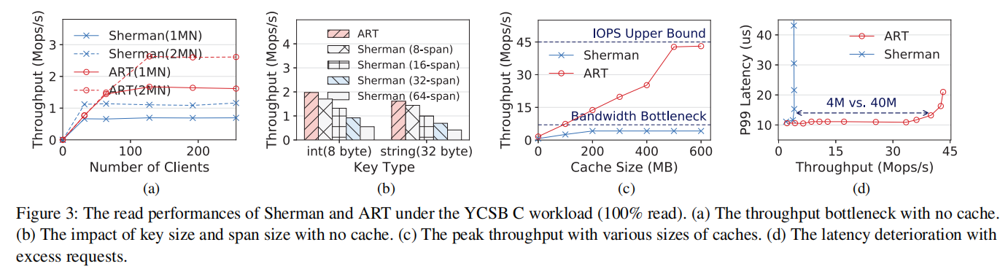

## range index
- distributed range indexes are fundamental building blocks of many applications:
    - databases (SQL, NoSQL)
    - key-value stores
- 在Disaggregated memory架构中，由于remote memory node 缺乏算力，依赖one-sided RDMA进行访存


# SMART: A High-Performance Adaptive Radix Tree for Disaggregated Memory

```shell
OSDI' 2023
```
## Key Points
### Try to Solve?
- Existing range indexes on DM are based on B+ Trees, which suffer from high read and write amplification
    - when read or write a key-value item in a B+ tree, one should search the tree by traversing many nodes which contain many useless keys and pointers since only one key is the target.
    - 从root开始逐层向叶子节点遍历 (指针跟随)
    - 每个叶子节点存储多个 key-value item; bandwidth consumption

### Motivation
- Reducing Read and Write amplification
- Radix Tree (读写放大因素较小)
    - partial key (a segment of bits of the whole key) in internal node

#### Analysus of B+ Tree vs ART on DM
- B+ Tree
    - stores whole keys in internal nodes and keeps multiple keys together in leaf nodes.
    - the B+ tree needs to read/write the entire nodes during each index operation, causing serious read and write amplifications
- 理论分析
    - 核心点每次read/write都需要操作一整个node; 而Radix tree每个node只存储一个item, B+ tree存储 S个item (eg. 32个)
    - 所以read/write amplification ratio 等于 读取数据的大小 / expect数据大小
    - 文章中虽然考虑了metadata size, 但是相比于 key-value item 本身size; 影响较小, 可以简单点理解为 ratio ~= S
- Experiment Results
    - Observation 1: The throughput of the B+ tree is bounded by network bandwidth in memory size. (B+ tree 读/写放大更严重； 图A~C)
    - Observation 2: The latency of the B+ tree is worsened by early network congestion (图D)

    

### Challenges for radix-tree on DM
- the costly lock-based concurrency control
    - causes many remote lock operations
    - local caches on computing side is used to reduce operation latency, but with radix-tree structure, the cached node may be changed frequently, leading to cache thrashing
    - cache-free 方法也不适合radix-tree, 因为cache-free方法需要out-of-place update (write/update 都申请一块新地址，只替换index中的address) => 不适合频繁更新的radix-tree, 因为每次address的变更都会导致cache coherence issue, 因为CN端缓存了address
- Inter-client redundant I/Os on DM waste the limited IOPS (IO per second) of RNICs.
    - **redundant I/Os on DM**
    - radix trees have multiple small-sized read/write operations when traversing/modifying the tree index
    - many of these read/write operations are redundant when multiple client on the same compute node
- the complicated computing-side cache validation
    - 在Radix tree中，通过path compression来减少树的高度和节点数量，从而提高查找效率
    - path compression 会导致节点的动态变化 （分裂，合并，以及地址的更新） => compute node中缓存的数据不一定是最新的，需要缓存验证

### Solve these challenges
- 解决 the costly lock-based concurrency control
    - a hybrid adaptive radix tree(ART) concurrency control: a lock-free internal node design and a lock-based leaf node design
    - homogeneous adaptive internal node
        - a naive ART stores partial keys and child pointers separately => hard for lock-free design
        - embeds the partial keys into slots => 可以原子的修改partial key + child pointer

    - Pessimistic 8-byte header of the internal node (悲观方法)
        - 路径压缩的三种方法
            - Pessimistic method
                - 将被压缩节点的所有partial key存储在后续节点的 header 中
                - 优点：可以在一次遍历中完成插入，因为所有的partial key都在header中
                - 缺点：可能会增加树的高度，因为如果partial key过多，需要额外的节点来存储
            - Optimistic method
                - 简单的丢弃被压缩节点的partial key，只存储depth value
                - 优点：减少内存占用
                - 缺点：插入时需要2次遍历，第一遍查询缺失的partial key；第二次遍历用于实际插入
            - Hybrid method
                - 在后续节点的header存储partial key，但当partial key过多时，会将超出的部分存储在Node中
                - 优点：在内存占用和插入效率之间取得平衡
                - 缺点：1，通常插入也需要2次遍历，第一次获取缺失的partial key；2，需要管理header + 后续node中的partial key，复杂度高 
        - SMART使用悲观方法来实现路径压缩
            - 针对Radix-tree树高度增加的问题，SMART通过缓存机制来减少对远程内存的访问，提高性能

- 解决 the IOPS breakthrough
    - a read-delegation and write combining(RDWC) technique

- 解决 cache validation
    - co-design SMART with ART cache

## Note
### Cache thrashing
- what is cache thrashing?
    - 当缓存被频繁的更新和驱逐时，导致有用的缓存数据被不必要的驱逐
- affects
    - frequent cache mis leading to low efficiency
    - CPU 占用率增加，被用在数据加载和交换上
    - latency 增加 & throughput 下降
- how to solve?
    - 优化缓存大小 + 缓存替换策略
    - 采用多级缓存
    - 优化代码和数据结构，来提高空间局部性和时间局部性
    - prefetching
    - 分布式系统中，使用缓存一致性协议来确保数据在不同缓存中的同步

### Spin lock
- 通过让线程在等待锁释放时不断循环（即spin 自旋）来实现互斥访问；注意不同用户互斥锁，spin lock不会是使线程进入休眠状态，而是保持运行，不断获取锁 => high cpu utilization