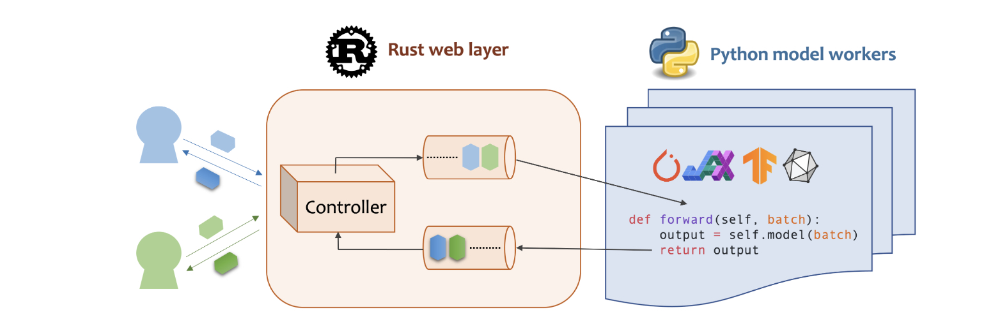

## Motivation Experiments
- 1, the time cost of attention in over-all latency distribution;
    - the latency of prefilling in overall latency
    - the latency of prefilling with prompt length increase
    <!-- - Note: 1, request 增长 -> latency increase  -->
<!-- - stacked bar graph.  y-axis: time cost distribution; x-axis: different models  -->
- 2, memory cost of kv cache. 
    - the occupy of KV-Cache, to illustrate why do the data offload and prefetch
<!-- - stacked bar graph. y-axis: memory size distribution; x-axis: different models;  -->
- 3, kv size vs batch size, which limits the throughput.
<!-- - line graph. y-axis: memory absolute size, x-axis: batch size; models with different lines. -->
- 4-a, latency vs w/wo kv cache, 
<!-- - clustered bar graph: y-axis: latency. x-axis: different models, each cluster: with kv cache, without kv cache; -->
- 4-b, memory size vs w/wo kv cache: 
<!-- - clustered bar graph: y-axis: latency. x-axis: different models, each cluster: with kv cache, without kv cache; -->

## Stable and light-weight llm inference platform
- Requrements:
  - 1, Support Dynamic Batching
  - 2, Support PageAttention(store KV-Cache Use Small blocks) - benefit for sharing
  - 3, Support Hierarchical Memory
    - 4, No dependencies on other model libraries; easy to change(based on Python/C++)
      <!-- - Keep the KV-Cache on each iteration
      - Sparsify -->
  - 5, Light-Weight
  - 6, How many people use and How many model it support

- Comparations
    - [DeepSpeed](https://github.com/microsoft/DeepSpeed) 30.4k stars
      - Microsoft
      - support all the requests
      - So big

    - [Megatron-LM](https://github.com/NVIDIA/Megatron-LM) 7.4k stars
      - Nvidia
      - not support Dynamic Batching and pageAttention
      - not support data offload during execution
  
    - [Alpa](https://github.com/alpa-projects/alpa) 2.9k stars
      - UC Berkeley
      - no longer actived(to [XLA](https://github.com/openxla/xla/tree/main/xla))
      - support dynamic batching
      - not support pageattention
      - provide self implementation for GPT and Bert moders (transfermer)
      - for other models, the backend is transformer from haggingface

    - [ColossalAI](https://github.com/hpcaitech/ColossalAI) 35.7k stars
      - HPC-AI Tech
      - self rebuld kernel like transformer
      - support dynamic batching and pageAttention
      - So big

    - [Fairscale](https://github.com/facebookresearch/fairscale) 2.7k stars
      - Facebook Research
      - based on Pytorch
      - support dynamic batching
      - not support KV-Cache

    - [Pax](https://github.com/google/paxml/) 324 stars
      - Google
      - Based on JAX

    - [Composer](https://github.com/mosaicml/composer) 4.8k stars
      - MosaicML
      - the backend is pytorch and transformer(huggingface)
      - not support dynamic batching and pageattention

    - [Moses](https://github.com/mosecorg/mosec) 655 stars
      - support dynamic batching (wait and batch)
      - Use Rust for server and Python for scheduler
      - only scheduler(relay on other platform like pytorch)
        <!--  -->

    - [OpenLLM](https://github.com/bentoml/OpenLLM) 7.4k stars
      - not support dynamic batching (support continues batching)
      - support pageattention
      - support Llama 2, OPT, GPT and so on
      - the backend is vLLM or Pytorch (Different LLMs may support multiple runtime implementations. Models that have vLLM (vllm) supports will use vLLM by default, otherwise it fallback to use PyTorch (pt).)

    - [vLLM](https://github.com/vllm-project/vllm) 12.4k stars
      - the backend is itself: [llama-forward](https://github.com/vllm-project/vllm/blob/358c328d69f62c1fdbd6deaf3b872809734c37b2/vllm/model_executor/models/llama.py#L193)
      - support pageattention
      - support Llama 2, OPT, GPT models
      - not support dynamic batching (support continues batching)

## Cache 淘汰算法
- LFU 
- LRU
- ARC (Adaptive Replacement Cache)

LFU Can Adapt with the new requests
