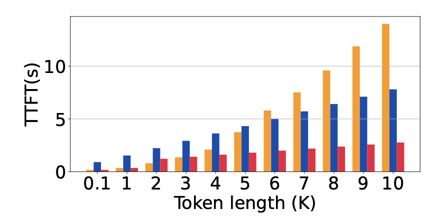
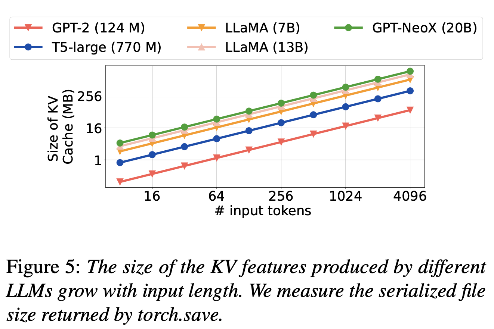

## Motivation
KV-Cache Reused Cross Requests can avoid some of token-profilling excution phase and reduce the first token-generated time(TTFT - time-to-first-token).

Need Experiment: 
1, the time cost of prefilling in over-all latency ditribution. - consider different models.
2, the latency of prefilling with prompt length increase.

PS: Original from CacheGen Figure.11, and the yellow column mean insert total context and be excuted by LLM Model.

3, memory cost of KV-Cache, with different models and different input prompt length.

4, KV-Cache size vs batch size, consider witch limits the throughput. with different models, and different batch_size. 

PS: Consider about the information provide by [DeepSpeed Inference](https://arxiv.org/pdf/2207.00032.pdf), **A small micro-batch count reduces the latency of token-generation but prolongs the latency of prompt processing, and vice versa.**

5.a, TTFT Latency compare with/without KV-Cache;
5.b, Overall Latency compare with/without KV-Cache;
- consider different models

6, memory size compare with/without KV-Cache.
- consider different models

# 试验结果：
1, 不同模型，不同prompt length下 prefilling阶段 在chat场景下的耗时占比  - Done
    - 补上 16K 以上的耗时占比
1.1 不同模型，不同prompt length下，prefilling阶段的固定耗时
    - 0.1K, 0.5K, 1K, 2K, 3K, 4K, 5K, 6K, 7K, 8K, 9K, 10K, 11K, 12K, 13K, 14K, 15K, 16K
2, 不同模型，固定prompt length下 + 不同的output length 下的耗时占比对比
    - 固定 prompt length = 16K, output_length = 0.1K, 0.5K, 1K, 2K, 3K, 4K, 5K, 6K, 7K, 8K
3, swap in 和 swap out 的耗时 与 重新计算的耗时对比 ( prefilling )
    - prompt length = 16K, output_length = 2K  不同模型
4, H20 编码之后 swap_in 和 swap_out 的耗时 与 重新计算的耗时对比 (仅prefilling + 整体)
5, KV-Cache size vs batch_size

## Challenges
1, How to storage the KV-Cache?

2, How to search fast?

3, How to reduce the communication costs?

3, when to offload and prefetch the KV-Cache?

## Solution
1, Use Trie Tree, (based on SGLang，but split requests and answers as different Node) Even the answer is different because of the sampling strategies, the KV-Cache of requests can also be reused.

2, Trie Tree.

3.1, Based on H2O, use sparcification can reduce about 80% of KV-Cache with limited accurary decrease
3.2, Based on CacheGen's **insight 3: The output from the LLM is more sensitive to losses in the KV feature values of the shallower layers than to those in the deeper layers.** Can schedule a group sparsification for different layers.

4.1, For KV-Cache Offload, Can use LFU to keep "hot data" in GPU Memory.
4.2, For Prefetch, Can load KV-Cache divice by device, Use sequence pallelism to load data.

## Date Time
|Week|Date|Plan|Progress|
|:--|:--|:--|:--|
|8|Feb 19 - Feb 25|1, 完成proposal draft； 2，梳理vllm代码，完成一次presentation；3，完成H2O编码 + swap in/out部分的代码||
|9|Feb 26 - Mar 3|||
|10|Mar 4 - Mar 10|||
|11|Mar 11 - Mar 17|||
|12|Mar 18 - Mar 24|||
|13|Mar 25 - Mar 31|||

目标：将历史KV-Cache，根据LFU策略将 hot KV-Cache放到GPU memory，并将cold KV-Cache offload到CPU memory中. 在新的request输入时，先读memory，避免重新计算

1, 支持PageAttention，block存储KV-Cache,减少读KV-Cache的communication Costs
2，支持batching 这个vllm也不支持
3，包含底层model的代码(KV-Cache层面)，因为涉及scheduler。