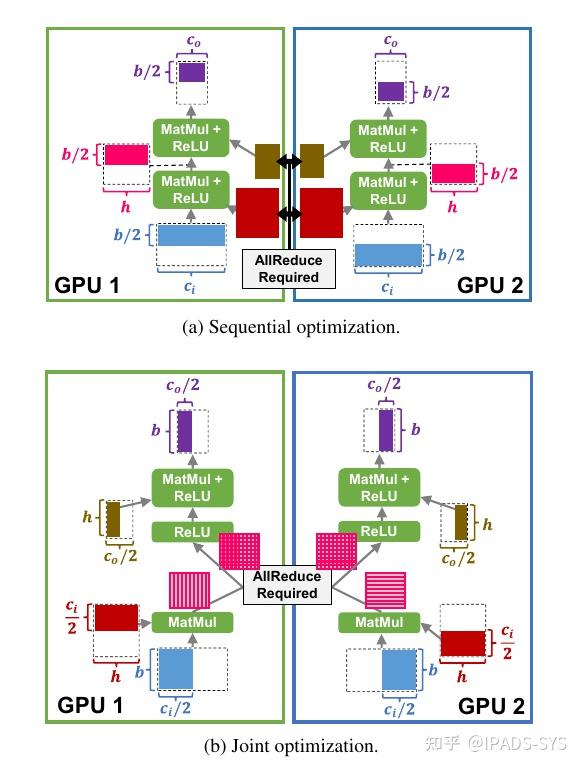
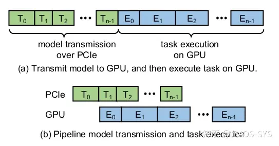
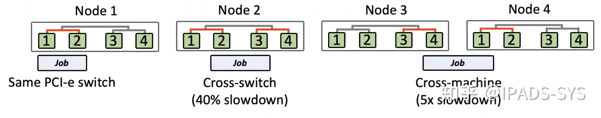
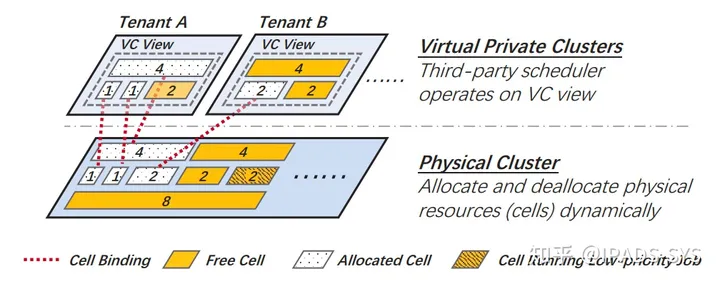
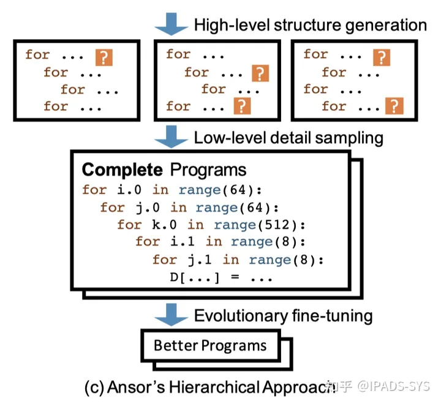
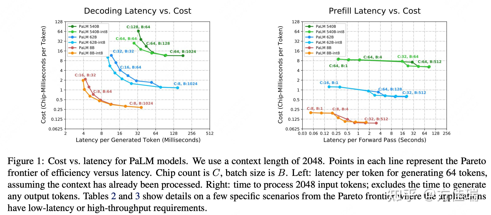
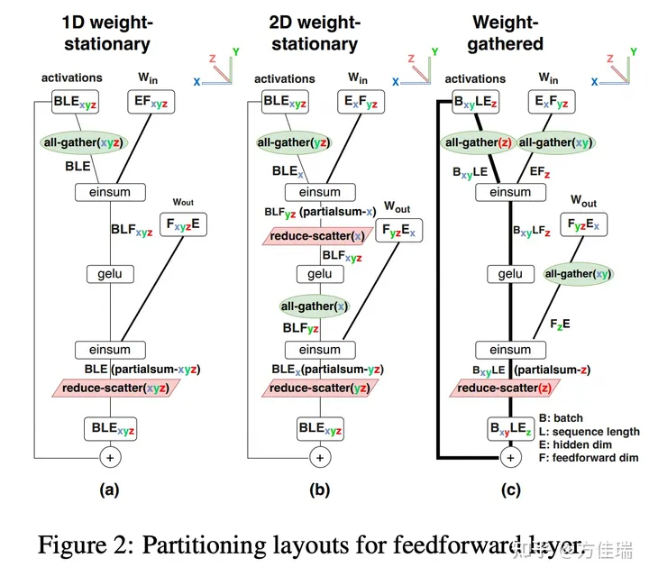
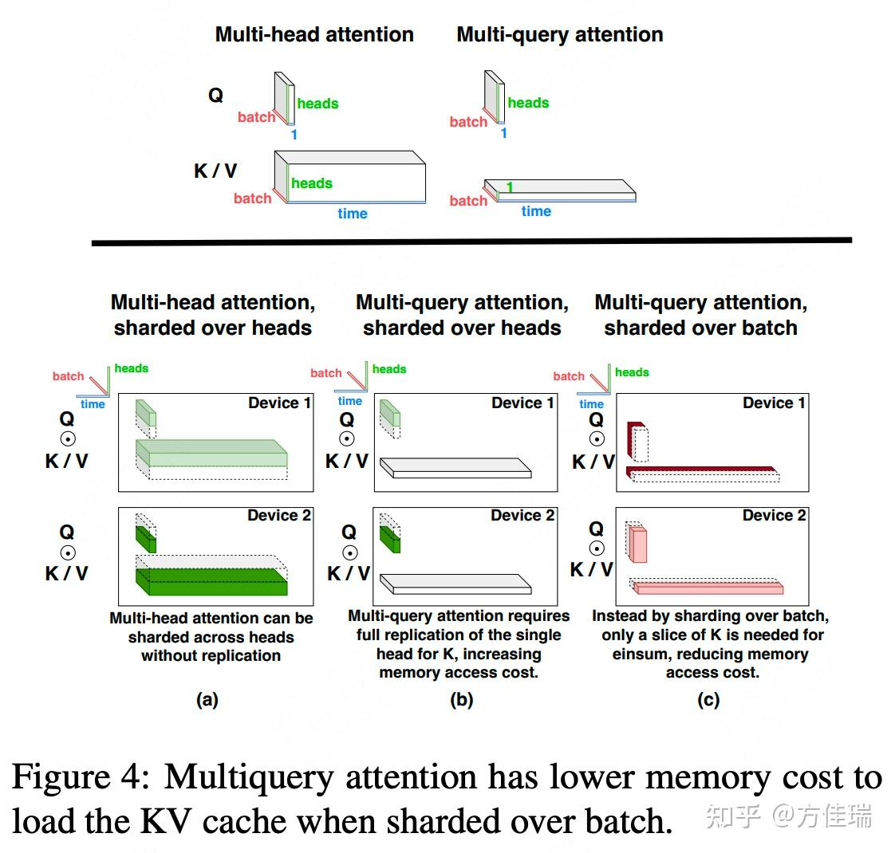

# 当前做MLSys的各个团队都在做什么？
汇总下2020-2023年四年的论文结果

## [OSDI '23]
#### AlpaServe: Statistical Multiplexing with Model Parallelism for Deep Learning Serving 
- Berkeley
- 解析：https://zhuanlan.zhihu.com/p/643392335
- 利用Pipelining继续提高并行度，从而实现更低的平均完成时间
  - 针对Inference场景
  - 通过Pipeline方案，将模型分开部署到不同的GPU上，来提高整体GPU的利用率。避免GPU1在计算task1时，GPU2完全处于waiting状态
    - 需要提前预知任务到达时间
    - 同一时刻1张卡上只有一个任务在执行 - 计算资源是原子不可以切分的
    - 不会出现不同模型Burst之间的重叠

#### Cocktailer: Analyzing and Optimizing Dynamic Control Flow in Deep Learning
- 编译相关
- Tsinghua University & Microsoft Research
- 解析：https://zhuanlan.zhihu.com/p/643392335
- 解决问题：现有DNN模型中，控制流和数据流需要在主机和GPU之间频繁同步。最多可以占据推理执行总时间的72%
- 将控制流融入到数据流中进行优化
- 3个优化机会：
  - 函数内联: 为了消除函数调用开销，Cocktailer将不包含递归的函数控制流转换为一系列计算。它消除了函数控制流的边界，并使得DNN优化能够在更大的程序范围上工作。
  - 循环展开：Cocktailer会通过几个步骤来探索更多的优化机会，将循环的控制流展开。例如，在嵌套的LSTM模型中展开循环可以暴露LSTM单元之间的并行性。循环展开步骤在调度过程中应用，并通过评估来决定是否启用此展开。
  - 递归展开：递归展开与循环展开类似，也可以将递归结构展开，以明确展示递归树结构。Cocktailer应用这种优化策略来展开DNN程序的递归结构，以便暴露更多的优化机会。例如，展开的递归树可以自然地展示递归步骤之间的并行性，可用于并发执行

#### Welder: Scheduling Deep Learning Memory Access via Tile-graph
- AI编译器 - 更好的利用GPU内存层级之间的带宽差异 + fusion操作
- Peking University & Microsoft Research
- DNN不仅是计算密集型，也是访存密集型
  - step1 将输入tensor从GPU内存加载到寄存器
  - step2 在计算单元中完成计算
  - step3 将结果经过GPU中的多个内存层级写回
- 内存层级越高，容量越小 => Tensor通常需要切分成多个tile完成加载和写回;
- 编译时利用计算图中的算子关系，可以从输出的tile，推出执行过程中tile的配置信息和输入tensor。
- 问题： 提到了**复用GPU共享内存**

## [OSDI '22]
#### Orca: A Distributed Serving System for Transformer-Based Generative Models
- 首尔大学
- 解析：https://zhuanlan.zhihu.com/p/541704684
- 在 Inference Serving System 中最典型的优化方式就是 Batching，也就是将一段时间内到达的用户请求合并到一起，提交到GPU中执行，从而提高系统的吞吐量。然而，与传统的 DNN Model 在推理时只要正向执行一遍不同，基于 Transformer 的 Generative Model 在推理时是迭代式的（Iterative)，每个请求都需要迭代式执行多次，每次生成部分结果（一个 Token)，且每个请求的迭代次数可能是不同的（例如迭代直到模型生成一个 End-Of-Sequence Token）。因此将现有的 Batching 方式应用在 Generative Model 时，可能导致有的请求已经迭代结束了，但是还需要和同Batch中没有迭代结束的请求继续一起执行。这个问题的核心在于，传统的 Batching 技术是以 Request 为粒度的，将多个 Request 绑定在一起提交给执行引擎，多个 Request 同时开始同时结束。当多个 Request 的计算过程一样时（例如传统CNN模型），以 Request 为粒度的 Batching 技术是合适的，但是在 Generative Model 中，不同 Request 执行过程是不同的（Iteration 的次数不同），因此需要一个新的 Batching 的方式，这也是本项工作核心的 Insight：使用更细粒度的，Iteration-level Batching，在每个 Iteration 中将不同的 Request 合并到一起。
- 问题：基于request的Batching策略，因为一起开始一起结束，所以效率较低
- 核心技术：Iteration-level scheduling
  - 并非所有的请求都能够在任意iteration被Batching到一起，典型的问题就是Batching的Input需要有想通的Shape - 例如想通的seq_len
  - 为了解决这个问题，Orca 提出了第二点核心技术： Selective batching。这个技术的Insight是：Transformer Layer里并非所有的算子都需要Batching的Input有相同的Shape，如下图所示，Add,Linear,GeLU等算子在计算时可以将一个Batch进行Flatten，这样不同 Sequence Length 的Input也可以Batch到一起进行计算；而对于其他必须有相同Shape才能Batching的算子（例如Attention），则对不同的输入进行单独的计算。

#### Microsecond-scale Preemption for Concurrent GPU-accelerated DNN Inferences
- 上海交通 IPADS 实验室
- https://zhuanlan.zhihu.com/p/541704684
- 针对Inference，有两种任务类型：1，real-time tasks 延时敏感任务，需要online支持，2，非延时敏感任务(文中叫best-effort tasks); 针对RT tasks, 一般GPU的利用率不高，所以作者提出一种通过抢占式GPU任务调度来保证RT低延时，同时scheduling BE tasks来提高GPU利用率的方法
- RT有更高的优先级
- Reset-based Preemption：基于DNN推理任务的GPU Kernel具有幂等性的观察，本工作提出了通过"kill"来实现在GPU上的快速任务抢占。
  - 幂等性：对于相同的输入，总会得到相同的输出
  - Massive kernels：传统的GPGPU应用一般只有几个或十几个GPU Kernel，而DNN Inference任务往往具有数十或上百个GPU Kernel（在本工作的测试中，一个模型最多具有307个Kernel）。在执行如果巨大数量的GPU kernel时，kernel launch的性能开销会尤为明显。为了避免kernel launch的性能开销，一般的execution engine都会选择异步的将所有kernel全部提交到GPU runtime后，再同步等待结果。这个特性导致在实现GPU任务抢占时，除了正在执行的kernel，还有数十上百的kernel存在于GPU runtime中，对这些kernel的抢占也会显著的影响任务抢占的时延。
- Dynamic Kernel Padding: 基于DNN推理任务的GPU Kernel具有时延可预测性的观察，本工作提出了一种可控的并发执行方法，在 real-time kernel 执行时，根据其执行的时延，动态的填充合适的 best-effort kernel 与其并发执行。
  - 执行时间可预测
  - 资源利用率动态变化 - 动态的计算资源分配机制

#### Alpa: Automating Inter- and Intra-Operator Parallelism for Distributed Deep Learning
- UC Berkeley - RISE Lab
- 为深度学习应用自动寻找最优的模型并行方案 - Data并行，Pipeline并行，Tensor并行等 (大模型难以部署在单一GPU上)
  - 算子内并行，即将同一算子按照数据维度划分到不同设备的并行方式，通常会需要合并计算结果，其带来的如All-Gather通信会引入较大的通信开销，因此对设备间的通信带宽与延时有较大要求；
  - 算子间并行，即将不同算子划分到不同设备的并行方式，则只需要在相邻算子之间进行单向通信，因此对通信带宽的要求较低
- 这两类并行技术对通信的要求，正好与集群中设备之间的层次关系对应：例如，同一台机器内的不同CPU核、不同GPU卡可以以较大带宽互联，而不同机器则由较低带宽的网络互联。
- 基于这一观察，作者提出可以将求解分为两个层次的子问题，并与集群资源的层次对应起来：
  - 在第一层，仅考虑粗粒度的算子间并行，将整个计算图以算子为粒度，划分为不同的stage。同时，将集群中的设备划分为多个submesh，并与stage一一对应。
  - 在第二层，仅考虑细粒度的算子内并行，根据第一层指定的计算图与设备的划分方式，求解出最优的算子内并行方式。
- 任务抽象：然后通过动态规划 + 剪枝策略 来更快得到最优的Scheduling

#### Looking Beyond GPUs for DNN Scheduling on Multi-Tenant Clusters
- Microsoft Research
- 提供了一种面向多租户集群的DNN任务调度器，在传统调度器的基础上将任务对CPU及内存资源分配的敏感度纳入考虑，从而更好的分配和利用现有的集群资源，提高平均任务完成时间。
- 问题：当前的集群调度器都假定GPU为调度任务的主要资源，然而CPU、内存等其他资源只是根据GPU数量按比例分配(GPU-proportional allocation), 但是对于不同的DNN训练任务，其对CPU，内存等资源表现出不同的敏感度 （注：文章通过实验证明了大部分语言模型对于CPU分配不敏感，因为语言模型对输入数据的预处理的要求相对较少）
- 利用敏感分配：这里分配的资源是指CPU，内存等除了GPU之外的硬件资源

#### Roller: Fast and Efficient Tensor Compilation for Deep Learning
- Microsoft Research
- 解析： https://zhuanlan.zhihu.com/p/541292053
- Tensor编译器
- 通过构造的方案生成Kernel，来降低tensor kernel编译生成的时间
- 观察到在做矩阵运算时，一次导入行数据能较低memory transaction；基于这一观察,roller从graph-level DNN编译器拿到表达式之后，得到其中的tensor的形状，并根据硬件的特征构造rTile。rTile会根据memory bank，memory transaction的大小，GPU warp大小等等和硬件特征对齐。再此基础上，生成rProgram。通过performance model选出性能最好的rTile配置。rProgram最终可以生成到kernel代码。

#### Walle: An End-to-End, General-Purpose, and Large-Scale Production System for Device-Cloud Collaborative Machine Learning
- Zhejiang University and Alibaba Group
- 解决大规模工业场景下，大部分机器学习任务有着比较严格的延迟限制；基于这个问题，作者提出了端-云协同的机器学习范式，将机器学习任务分发到数以亿计的移动设备上去与云协同执行

#### Unity: Accelerating DNN Training Through Joint Optimization of Algebraic Transformations and Parallelization
- CMU & Stanford
- 合并使用算子合并(fusion) + 并行（data parallilism等） => 同时进行两个优化
  - （1） 数据并行（Data parallelism），每个设备上保留模型的副本，为每个设备分配训练集的一个子集
  - （2） 模型并行（Model parallelism），模型被划分成不相交的子模型分布在设备上
  - （3）空间并行（Spatial parallelism），将tensor在一个维度（比如图像的行或列）上划分为多个partition，分配给设备。
  - （4）归约并行（Reduction parallelism），比如计算C=A\times B，将A按列划分，B按行划分，每个设备计算C_i=A_i\times B_i。
  - （5）流水线并行（Pipeline parallelism），探索在不同的训练迭代之间的并行机会。
  - （6）操作特定的并行（Operator-specific parallelism），一些新的DNN操作会带来一些并行的机会。
- 在一些场景下，不合并算子，反而能够带来更好的规约并行结果：

## [OSDI '21]
#### Pollux: Co-adaptive Cluster Scheduling for Goodput-Optimized Deep Learning
- 分布式深度学习集群调度问题 - 更好的为深度学习任务分配硬件资源来达到最佳效果(超参数)
- Pollux提出goodput的概念，结合了throughput与模型收敛速率两个指标，是一种系统研究中很经典的全局优化的思路,跟2020年的Kungfu
- 基于假设：deep learning训练的任务在给定的独占计算资源下，性能表现非常可预测. 作者构建一个cost model作为协同优化的指导

## [OSDI '20]
#### A Unified Architecture for Accelerating Distributed DNN Training in Heterogeneous GPU/CPU Clusters
- ByteDance & Tsinghua University
- https://zhuanlan.zhihu.com/p/529364947
- 优化分布式DNN训练的参数更新过程，提高CPU利用率和网络利用率 - 使用CPU来计算参数更新 & 增加了通信
  - 观察到：在GPU节点上的CPU以及网络的利用率都非常低：20%-45%的网络被闲置，CPU的利用率也只有20-35%。
  - 因此，本文提出的BytePS通过将参数更新聚集的操作划分为CPU就可以完成的Summation Service和需要网络传输的Communication Service

#### Heterogeneity-Aware Cluster Scheduling Policies for Deep Learning Workloads
- Stanford & Microsoft Research
- 针对集群中的异构环境(异构加速器：GPU，TPU，FPGA 甚至是专用的ASIC，即使是GPU，也有着不同的型号)；不同设备的性能和成本上有差异，不同的DL模型在不同的加速器上训练的吞吐量也有差异
- 作者提出了如何对一个异构环境下的调度问题进行建模，来得到最优的资源分配方式

#### PipeSwitch: Fast Pipelined Context Switching for Deep Learning Applications
- John Hopkins
- 如何在GPU上进行深度学习任务的快速上下文切换，从而使多个深度学习任务在保证推理任务SLO的前提下并发地运行在一个GPU上，提高GPU的利用率。
- 深度学习任务：1，对时延敏感的推理任务； 2，对吞吐敏感的训练任务；
- 生产环境中，为了保证推理任务的SLO，一般都会将训练任务和推理任务分开部署到不同的GPU集群，甚至推理任务也会为不同的应用单独分配独占的GPU。而深度学习推理服务的负载一般都有明显的周期性，例如在白天时负载较高，晚上时负载则比较低，在这种场景下，独占式的资源分配就会显著降低GPU的资源利用率。一个很直观地想法就是像当前提高CPU利用率的一样让不同的任务共享GPU资源，但与CPU不同的是，不同任务在GPU上进行上下文切换时会有比较大的开销（数百毫秒至秒级），这会严重影响推理任务的响应时间，本项工作的主要目标就是降低深度学习任务在GPU上进行上下文切换的开销。
- GPU的上下文开销主要包含：
  - Task Cleaning，例如释放GPU显存
  - Task Initialization，例如启动进程、初始化CUDA context等
  - Memory Allocation
  - Model Transmission，即将DNN模型从Host Memory拷贝到Device Memory
- 深度神经网络都具有层级结构，每一层进行前向计算时只需要知道上一层的输出以及当前层的结构以及参数，不需要知道后面网络层的信息。因此可以使用经典的流水线（pipeline）技术来优化，即按照神经网络的layer顺序进行内存拷贝，拷贝好的layer可以直接进行计算。如果简单的使用per-layer的方法进行pipeline会导致每次拷贝完一层后的synchronization带来太大的开销，作者针对这一问题也提出了对layer进行group（batch）的方法，并给出了寻找最优的group组合的算法。

- 除了内存拷贝的开销，上线文切换还有一大部分开销来自于CUDA环境的清理和初始化，PipeSwitch提出了Active-Standby Worker方法，用多个常驻的进程作为Worker，能够在保证进程级别隔离的前提下，避免上下文切换时任务清理和初始化的开销；同时，PipeSwitch使用了统一的内存管理来降低内存分配的开销。

#### HiveD: Sharing a GPU Cluster for Deep Learning with Guarantees
- Peking University & Microsoft
- 解决的问题：租户在GPU集群上进行深度学习的训练是一种目前较为常见的使用场景。然而，由于目前GPU集群上的资源分配方式是基于quota的，即每个任务指定所需要使用GPU的数目，导致会出现即使分配了足够的GPU数目，也会导致该任务的等待时间或者执行时间大幅下降，该现象被称为共享异常（Sharing anomaly）
- 原因：因为仅仅指定GPU的数目是不够的。由于不同用户随时可能会要求分配或者释放GPU数目，就会导致出现大量的外部碎片（external fragmentation）。这个外部碎片的概念与内存分配中的概念类似，即随着分配、释放的次数变多，大量的GPU数目可能会变成跨CPU socket、甚至是跨机器。如下图所示，同样是分配2个GPU，如果是跨PCI-e、跨机器，将会分别带来40%和5倍的性能下降。因此，造成了虽然分配了足够的GPU，但是还是会导致性能的大幅下降。同时，由于会有许多1个GPU资源的请求，导致多资源的请求不能很快得到满足。

- 为了解决上述的外部碎片的问题，HiveD提供了一层被称为VC（虚拟集群）的抽象，让用户更加细粒度的去指定GPU的分配方式，像是在私有集群上进行分配一样，这个目标被称为sharing safety。同时也用了buddy cell allocation的机制，其中cell是指不同层次的GPU资源。其中Level-1到level-5分别是指单个GPU、共享PCI-e的一组GPU、共享CPU socket的一组GPU、同一机器上的GPU、同一机架的GPU。这样，通过制定不同层次的cell数目，来进行虚拟的GPU资源分配，同时映射到物理资源分配，如下图所示。Buddy让人联想到内存分类的buddy allocation，事实上，两者确实是类似的机制。也即在申请Level-k的cell时，如果该level的空闲队列中有空闲资源，则直接分配，否则递归地从Level-(k+1)中拿出一块来进行分裂，并将剩余分裂后的空闲资源放入level-k的空闲队列中。这样能够保证资源分配的局部性。同时，在资源回收的时候，也会去递归地查看是否能够将空闲资源从level-k合并为level-(k+1)。

#### AntMan: Dynamic Scaling on GPU Clusters for Deep Learning
- Alibaba
- 本项工作与上面介绍的PipeSwitch工作有一样的目标，就是通过多个深度学习任务共享GPU来提高GPU集群资源利用率，不同的是PipeSwitch面向的场景是深度学习推理任务作为高优先级任务，可以用训练任务来填满推理任务使用的GPU资源利用率；而AntMan面向的场景是深度学习训练任务有高低优先级之分，可以用低优先级的训练任务来填满高优先级训练任务的GPU资源利用率。

#### Ansor: Generating High-Performance Tensor Programs for Deep Learning
- Lianmin Zheng UC Berkeley
- https://zhuanlan.zhihu.com/p/529370952
- 问题：面向DNN的编译问题：依赖硬件厂商提供的高度优化过的计算库(like cuDNN)；这依赖专家coder来实现，并限制了新operator的开发和计算硬件的使用. 现有的Tensor Compiler由编译器根据硬件特性进行自动优化并生成硬件代码；但是普遍搜索空间较小 - 将算子处理成顺序执行的小operation
- 一个tensor计算程序自动优化和自动生成的框架。Ansor主要从两个方面去提升tensor计算程序优化的效果，第一是使得优化的搜索空间足够大，第二是提高搜索的效率和优化搜索策略，使得在很大的搜索空间里能够快速正确地搜索到性能较优的计算程序。
  - 首先，为了使程序优化的搜索空间足够大，Ansor提出了two-level hierarchical search space，分成了high-level structure generation（sketch）和low-level detail sampling（annotation）两个层次。
  

#### Rammer: Enabling Holistic Deep Learning Compiler Optimizations with rTasks
- Peking University & Microsoft Research
- 问题：在现有深度学习框架中，操作符间并行(matmul, Convd)主要由深度学习框架中的数据流图调度器进行调度；而操作符内并行主要有底层硬件计算库中的硬件调度器进行调度。作者认为这种结构忽略了操作符间并行和操作符内并行之间的相互影响。
- Rammer系统：将操作符间并行和操作符内并行进行综合考虑，作为一个整体进行调度
  - 虚拟化并行设备的抽象，通过将硬件中的执行单元抽象为虚拟并行设备中的虚拟执行单元，来更好的管理硬件中的细粒度调度能力。
  - 为了解决细粒度调度带来的巨额开销，Rammer基于观察：深度学习中的各个操作符的执行时间是编译时可预测的(误差在7%以内), 选择在编译器阶段沈城执行调度，这样可以大大减少模型执行的调度开销

#### KungFu: Making Training in Distributed Machine Learning Adaptive
- Imperial College London
- 实现高效的训练时自动调参
  - 很多工作在执行时，通过checkpoint的方式来调整提供参数，这会使得系统需要restart，引入非常大的adaptive延迟
- 思路：再生成计算图的时候就将adaption的流程放到计算图中去

## [MLSys '23]
#### Efficiently Scaling Transformer Inference
- Jeff Dean
- https://zhuanlan.zhihu.com/p/660715870
- 问题：针对LLM推理应用：1延迟敏感的在线推理 + 2追求高吞吐低成本的离线推理。大模型推理可以分解为处理prompt的的阶段（prefill）和自回归生成输出标记解阶段（Decoding）。二者性质不同，前者是计算密集型的，后者是访存密集型的。尤其是，Decoding阶段以难以优化而臭名昭著。因为每次只能解码一个token，计算量本来就很小，还需要访问一个随着解码步数增加而不断累计KVCache，因此严重受限于加速卡的片上带宽.
- 关注并行策略
- 第一个内容：经验性结论：在不同的Batch Size, 模型尺寸，芯片数量下，最优的模型切分策略应该是不同的；如下图

- 第一个内容：Partitioning Framework：提出了一套表示并行化的抽象符号体系：用来表示Tensor layout 和 device mesh的映射。(**没咋理解，还需要深读论文**)；总之提供了一套数学公式来更好的表示tensor粒度的split和计算所需要的通信量。
  - 1）Shard表示：使用下标来指定被shard的张量维度。例如，符号BLE_xyz表示逻辑形状为BLE的张量的最后一个维度E被分割成X × Y × Z个分区，其中x、y和z表示物理TPU v4轴，每个芯片的张量形状为[B，L，E/(X × Y × Z)]。
  - 2）Replicated表示：如果一个张量在轴x上被replicated存储，那么该轴将在符号中被省略。
  - 3）Partial表示：后缀“partialsum-x”来表示给定的张量已经在每个芯片上locally地进行了处理（concate或sum），但仍需要在TPU x轴上对芯片进行求和才是最终结果。
- FFN 并行方法
  - 可行的有三种：1D-weight就是Megatron-LM中的FFN并行方法，用一个column-wise+row-wise TP，forward只需要Allgather+ReduceScatter两次通信。后两者大大家不常见，它对weight的两个维度都进行partition，对2D对activation最低维度切分，weight-gather则对最低和最高维度分别切分。值得注意的是，作者对L维度没有切分。
 
- Attention Layer 并行方法
  
  - MQA减少了访存，但是增加了并行通信开销
- 进行了模型架构微调：与GPT结构不同，PaLM中对FFN和Attention Layer的操作是并行的(algorithm层面)
- Low-level设计：Looped CollectiveEinsum技术，是的通信和计算同时进行，简单来说就是把矩阵乘法和通信分块流式起来，隐藏通信开销。

#### [ASPLOS '23] Overlap Communication with Dependent Computation via Decomposition in Large Deep Learning Models
- Looped CollectiveEinsum技术，是的通信和计算同时进行，简单来说就是把矩阵乘法和通信分块流式起来，隐藏通信开销。

### Nvidia Megatron 系列
[ '20]

[MLSys '23] Reducing Activation Recomputation in Large Transformer Models 

- 别人的总结 https://www.cvmart.net/community/detail/5655

|年份|会议|题目|方案|备注|
|--|--|--|--|--|
|2016|MICRO|VDNN|转移|第一篇转移到Host Memory的工作|
|2016|arXiv|Checkpoint|重计算|第一篇重计算|
|2018|DATE|moDNN|转移|考虑不同卷积函数的性能|
|2018|PPoPP|SuperNeurons|转移+重计算|第一篇转移+重计算|
|2018|HPCA|cDMA|转移+压缩|硬件对ReLU输出层压缩 - ReLU输出是稀疏化的|
|2019|IPDPS|vDNN++|转移+压缩|针对vDNN的性能问题进行解决|
|2020|ASPLOS|AutoTM|转移|NVM+DRAM的暴力搜索|
|2020|ASPLOS|SwapAdvisor|转移|启发式搜索+GPU碎片问题|
|2020|ASPLOS|Capuchin|转移+重计算|转移+重计算的较为优秀的方案|
|2021|FAST|FlashNeuron|转移|引入SSD转移|
|2021|ATC|ZeRO-Offload|转移|利用CPU的计算能力|
|2021|CLUSTER|CSWAP|转移+压缩|对稀疏数据进行选择性压缩，最优化性能|
|2021|HPCA|Sentinel|转移|NVM+DRAM场景，考虑细粒度Page上的数据情况|

# 问题
### LLM 
- Pre - mostly based on CPU
  - Tokenization

- Transformer Layer
  - self-attention: Wq, Wk, Wv and Wo + bias; witch means for hidden length h=4096, need 4h^2 + 4h
  - FNN: 2 layer mlp with [h, 4h] and [4h, h]; need 8h^2 + 5h parameters

- Memory Size
  - For Training Process:
    - model parameters (eg: for 7B model, this part takes about 20GB)
    - forward intermediate data
    - backward gridient data
    - adam optimizer states (1阶 + 2阶)
  - commonly, researchers use float16 to storage model parameter for training;
  - but while in backward processs, use float32 to keep parameter, gradient, adam states.  => which means every model parameter will cost (2 + 4) + (2 + 4) + (4 + 4) = 20 Bytes

- Input Data
  - for GPT3, 570GB

- **Persistent or Temporary**
  Persistent: parameters
  Temporary: KV-Cache, intermediate data, gradient data, adam optimizers.

### Problems (Data Swap)
- Offload:
  - offload between GPU and HM
  - offload between GPU and extra memory
    - shared memory space
    - GPUDirect, PCIe
  - Types:
    - Read Only: input tokens
    - Write Only: -
    - Keep consistant: parameters
    - Read and Write: others
- Prefetch:
  - need to predict the following executed layer
- Memory Fragmentation:
  - memory virtualization + not continuely storage
  - page-cache page
- Aync communication
  - cudaMemcpyAsync
  - GPUDirect / flashneuron

### Scheduling
- Data parallelism
- Pipeline parallelism
- Tensor/Operator parallelism

### Week5 留下的问题
- LLM的特征
  - why transfermer层的 QKVO 是[h,h]
  - 训练时，是否所有tensor是equal access? (weight/input/intermediate)
    - DNN 因为存在随机mask过程(预防overfit)，会有数据上的hot data 和 cold date，这个是否在LLM中也有？

- PreToken处理是否是处理一次即可？
  - 是否有可能让CPU参与进来？
  - GPU <-> CPU <-> CXL ?

- 充分考虑下不同的scheduling strategy, 是否会造成不同的问题？
  - DRAM usage

- 方法是否是仅针对LLM；需要一个强力的motivation: why we do this?
  - LLM vs LLM
  - LLM vs DNN

- 备注：
  - 自助切分LLM进行硬件搜索，由于Transormer的结构是每一层都在重复，可以做好剪枝，复用结果