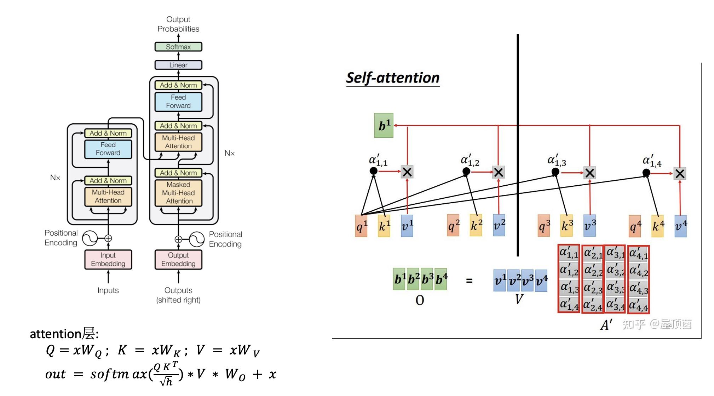

1, for chat history，with webserver like ChatGPT API, they provide a request sample like below, But, for LLM, how model figure out chat history?
    - dose all of these was processed by CPU
```
# a sample for chat history
openai.ChatCompletion.create(
  model="gpt-3.5-turbo",
  messages=[
        {"role": "system", "content": "You are a helpful assistant."},
        {"role": "user", "content": "Who won the world series in 2020?"},
        {"role": "assistant", "content": "The Los Angeles Dodgers won the World Series in 2020."},
        {"role": "user", "content": "Where was it played?"}
    ]
)
```

2, for LLM Inference, with same chat history and requests, the answer will always be same or not?
    - and for a batch of input with different, need to do padding or excute one by one in GPU MAC?
    - does the masked layer also be used for toke generation?


3, Sparsification of LLM
    does there some part of the layer is more important to the activations in LLM. like group sparsification? or dynamic sparsification?

4, With reuse of input prompt, can use a larger batch size for token generation.