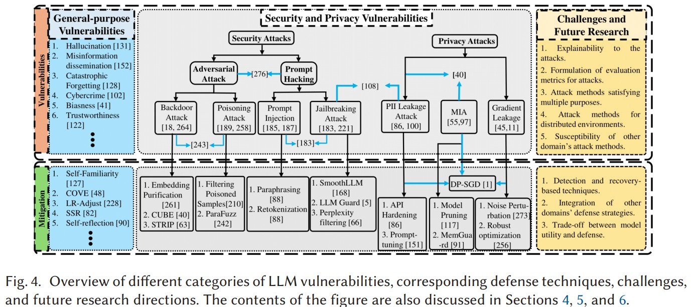
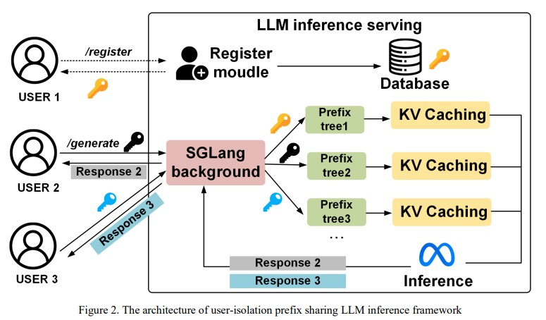
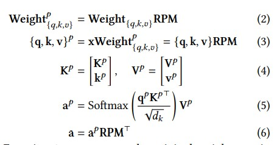
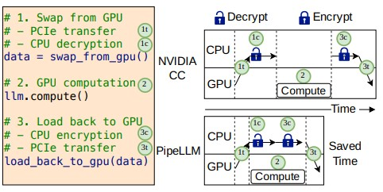

# LLM & Security

## SafeKV
#### Design
- 1. AdaptiveGuard：自适应隐私检测与分块策略
    - 目标：在KV-cache存储时，实时检测 和 提取包含隐私数据的块
    - 机制：
        - 隐私数据包含很多pattern，实现简单的按pattern的提取
        - 支持自适应拓展，用户可以增加关注的隐私信息和pattern
        - 隐私块检测：(existing work分析)
            - 正则化模式检测慢
            - 分层：light-weight model检测是否包含隐私信息
            - 仅在将 KV-Cache 存储写入Radix-Tree时需要处理(不频繁)
        - 像User Name, Address这种没有明显pattern的case？
            - 基于语义的 privacy 检查
            - transformer-based model来判断 (light-weight)
            - 潜在的privacy info (语义上的: 比如地址信息分散在一段话中，从语义上整段话都是privacy的)

- 2. Cache management
    - 目标：动态管理私有与共享缓存的内存分区，适应不同隐私情况。
    - 机制：
        - 根据每个 块 的隐私检测结果，动态将其分配到用户私有缓存或全局共享缓存；
        - 对于以private node为根节点的子树，"search时合并子树，减少搜索深度"
            - 回收时，考虑到单个用户的request可能"重启"，evict时根据memory capacity从privacy尾部删除 (不一次性删除全部子树)
        - evict policy统一私有和共享缓存的管理
            - LRU 会导致私有 KV-cache 优先被删除 (frequency低)
            - privacy-aware 感知的lru policy；(epoch宽度)
        - 实时监控系统中隐私请求比例，调整两者缓存大小比例；
            - 性能与privacy的 trade-off
            - 自适应的指标

```shell
        ...
    |private-1|
    # |node-1 (pri)|
    # |node-2|
    # |node-3|
    |node-4|
```

- 3. Cache Evictor: 异常感知驱逐机制
    - 目标：防止缓存探测攻击并清除潜在误判内容。
    - 机制：
        - 对缓存条目的访问频率（当前窗口 vs 之前窗口）进行实时监控；
        - 若命中次数异常突增（e.g., hit_cur ≥ 2 × hit_prev），判定为探测行为；
        - 仅驱逐该条目的 KV 数据，保留其结构元信息以保持上下文完整。

## 大家在研究什么
- 参考论文
```shell
Security and Privacy Challenges of Large Language Models: A Survey
Institution: Florida International University
Conference: ACM Compute Survey, Feb 2025

The Emerged Security and Privacy of LLM Agent: A Survey with Case Studies
Institution: University of Technology Sydney
```
- Categories
    - Security attack (training/fine-tuning phase)
    - Privacy attack (inference phase)
        - LLM在generate answer过程中,可能回无意中捕获或者copy训练数据中存在的敏感信息
        - 大多数现有的隐私攻击都是针对视觉模型设计的


- Details
    - Prompt Jacking
        - Prompt injection
            - 误导LLM的一种直接方法是让它们忽略之前的prompt
            - Defense: 释义(破坏指令的顺序);数据提示隔离/指令预防;基于困惑度的主动检测方法(困惑度超过阈值 => 指令受损)
        - Jailbreak attack
            - bypassing 预先定义好的约束和限制,使其违反开发人员设置的基本安全限制
            - 例如: 利用LLM的拟人化和指令遵循能力,通过要求LLM以嵌套方式响应有害查询来催眠LLM,从而绕过LLM的基本安全策略
            - Recent studies focused on jailbreaking attacks in multi-model settings.例如通过视觉对抗样本来攻击MLLM
            - Meta提出了Llama Guard方法,等
    - Adversarial Attacks (对抗性攻击)
        - 对抗性样本 $x'$ 是通过对 LLM 的训练数据进行最坏情况扰动而得到的
        - backdoor 攻击
            - 恶意用户可以在模型微调期间将少量窃取提示(后门)插入良性数据集
            - 目前backdoor攻击侧重关于简单的学习任务(如分类),在大规模LLM上尚未得到验证
            - Defence:  白盒方法: 1,微调移除backdoor,2,模型剪枝,3,通过检查激活值检测backdoor; 目前黑盒环境下的backdoor预防策略仍然缺乏
        - 数据poisoning attack
            - 训练数据,可能包含外部/未经验证的数据来源,包含被操纵的数据样本,比如将触发代码直接注入到训练数据中
            - 向RAG知识库中注入中毒样本,来攻击基于RAG的LLM agent
            - 目前很少有解决方案可以防御 LLM 中的poisoning攻击。通常,数据验证、过滤、清理和异常检测技术已被用于保护 ML 模型免受中毒攻击 (poisoning数据通常是训练数据分布中的异常值)
    
    - Gradient Leakage Attacks
        - 可以通过梯度重建隐私训练样本
        - 依赖 白盒访问模型,且只能在token级别重建训练数据
        - 在梯度中插入随机噪声、动态规划 (DP) 和同态加密。
        
    - Membership Inference Attacks (MIAs) / Inference Attack
        - 估计特定数据样本属于 LLM 代理训练数据集的概率
        - 为了缓解语言领域的 MIA,提出了几种机制,包括 dropout、自动识别、模型堆叠、DP 和对抗性正则化。

    - PII Leakage Attacks
        - PII指能够唯一识别个人的数据,如姓名,电话号码,SSN,财务记录,医疗记录等信息
        - LLM 会记忆并可能泄露单个训练sample
        - PII屏蔽 (海量数据,开销大);DP等方法


## KV Cache related Security
### I Know What You Asked, NDSS'25
```shell
I Know What You Asked: Prompt Leakage via KV-Cache Sharing in Multi-Tenant LLM Serving
Conference: NDSS'25
```
- 问题: 针对KV cache reuse下的攻击: reconstruct prompt,提取隐私信息
- 方法: PromptPeek攻击方法
- 补充知识: KV cache sharing may lead to new side channel attack vectors
    - 侧信道攻击: 本文中指观测模型的响应时间差异,来判断是否命中KV cache reuse. (无需访问模型参数,仅通过对比命中／未命中缓存的响应时延,即可以百级查询开销完成对敏感 Prompt 的逐 token 重建或识别)
- extracts one token from another user’s prompt at a time, progressively reconstructing the entire prompt by repeating the token extraction procedure.
- 针对的攻击模型：攻击者掌握了用户提示模板的额外信息，并尝试重建用户的准确输入
    - cloze-style prompt: 完形填空(不完整的句子或段落), 缺少单词或者短语
    - prefix-style prompt: 
- 通过prompt engineering + local LLM来生成candidate

### InputSnatch: Stealing Input in LLM Services via Timing Side-Channel Attacks
```shell
InputSnatch: Stealing Input in LLM Services via Timing Side-Channel Attacks
Institution: 
Conference: ArXiv Nov 2024
```
- 核心方法于PromptLeakage一致,都是利用可观测的侧信道信息来reconstruct用户prompt (latency:  图5显示了kv cache hit 和 miss之间的latency差异)
- 挑战: 
    - 1. search space (vocabulary size exceeding 100000 tokens)
    - 2. 可观测的latency受到网络延迟/memory scheduling lat的干扰
    - 3. Real-world constraints

### The Early Bird Catches the Leak: Unveiling Timing Side Channels in LLM Serving Systems
```shell
Institution: USTC & Indiana University Bloomington
Conference: Feb 21 2025
Link: https://arxiv.org/pdf/2409.20002
```
- 利用时序侧信道信息来detect privacy信息
    - memory sharing, cache contention and eviction and task scheduling among different users and applications can interfere with user requests, creating notice able timing side channels.
- 两种类型
    - KV cache泄露 (KV cache sharing of common prefix)
    - semantic cache泄露 (语义相同的response cache)
- 侧信道攻击 (在prompt空间搜索触发cache hit的tokens) 的挑战：
    - 命中单个缓存块所需的时间通常很小，并且可能与 GPU 系统噪声以及电压和功率波动混合，因此难以检测和利用
    - 键值缓存仅在提示共享公共前缀时才有效，这限制了攻击机会
    - 提示空间的庞大使得系统地测试每个潜在提示以找到已缓存的提示变得不可行
    - 攻击者自己的请求可能会在处理过程中被缓存，从而引入额外的噪声
- 方法
    - 在运行时动态调整时间阈值，提高在线检测准确率 (借助分类模型)
    - 增量搜索算法，减少搜索空间
    - 批量清除不相关请求机制来减少攻击者自身请求的干扰
        - 两次攻击之间插入无关请求
- 攻击分类
    - PSA prompt窃取攻击 (攻击系统prompt, 获取业务逻辑, 私有数据)
    - PNA 窥视peer攻击 (攻击用户输入中包含的私有信息)

### Cache Partitioning for Mitigating Timing SideChannel Attacks in LLM Serving Systems
```shell
Conference: ICFTIC'25
Institution: USTC
```
- 通过 partitions the KV cache into different prefix trees by user identities 来避免侧信道攻击
    - user-level isolation: a unique identifier (token) for each user
        - sha256 hash
    - client侧保存 user-identifier, 并且请求时带上
    - 只请求对应 user-identifier 的prefix tree KV cache


- 缺点：
    - 对于cross user sharing的影响
        - single-user TTFT increase from 4.64% - 9.10%
        - multi-user TTFT increase from 6.74% - 17.84%
        - 从对比看, 模型越大, 造成的TTFT delay越大
    - user-identifier也可能会被攻击
    - 每个用户单独prefix tree在batch检索可用的KV cache时需要逐一匹配

### 侧信道攻击的Defence思路
- 攻击方法：
    - 侧信道: KV cache hit => TTFT 小于 KV cache mis下的 TTFT
    - token-by-token 攻击 (detect?)
- 对KV cache分类
    - 包含隐私数据: session 内部share
    - 不包含隐私数据： cross-session sharing
- 挑战：
    - 隐私数据的detection
        - 分类学习方法: SVM/RNN
    - KV cache prefix tree的管理
        ```
        if (detect_privacy_info(prompt)) {
            return hash(previous_hash + prompt + session_id)
        } else {
            return hash(previous_hash + prompt)
        }
        ```
    - batch request的时候如何高效索引
    - 侧信道攻击检测
        - 滑动时间窗口 + cache_hit

## On-Device Attack
### A First Look At Efficient And Secure On-Device LLM Inference Against KV Leakage
```shell
A First Look At Efficient And Secure On-Device LLM Inference Against KV Leakage
Conference: MobiArch ’24
Institution: Central South University & Tsinghua
Link: https://dl.acm.org/doi/pdf/10.1145/3691555.3696827?casa_token=gZoLUCD7mncAAAAA:now44Y6q0oV7fZ6vEf_3NrTaNnF1G5EkehfBUgtG_kVhWbG8wtdgQO2oZ9NzTHV9uWhsDk4OZuzu
```
- 虽然 on-device LLM推理的准确性和效率已经得到了验证,但面临着安全性的严峻考验 => 移动设备的计算核心容易受到各种攻击,尤其是信息泄露。
- attacker可以利用攻击捕获的KV cache来重建整个对话,获取隐私信息
    - eg. AMD GPU上的 leftoverlocal
- 现有方法: 
    - 完全同态加密(FHE), 计算密集性太高, 导致推理性能下降(5-7个数量级),
    - 可信执行环境(TEE), 可信内存大小有限
- KV-Shield 方案
    - 思路: 1. 加密KV cache (置换); 2. 使KV cache不可见, (在TEE中处理KV pairs)
    - 置换: 对Attention中计算QKV的线性层权重, 打乱行数序 (乘上一个0-1矩阵); 得到的KV cache也是行乱序的; 恢复(逆置换): 在attention计算后, 逆置换结果, 得到正确输出
    - 逆置换在TEE中发生, 对外不可见 + size有限
    

### ISOLATEGPT - NDSS'25
```shell
ISOLATEGPT: An Execution Isolation Architecture for LLM-Based Agentic Systems
Conference: NDSS'25
Institution: Washington University in St. Louis
```
- 问题: 随着大型语言模型(LLMs)如ChatGPT等被扩展为独立的计算系统(代理系统),并开始支持第三方应用程序,这些LLM应用程序及其交互使用自然语言定义,被授予访问用户数据的权限,并被允许与其他应用程序、系统和在线服务交互,由此引发了一系列安全和隐私风险。
- 目标: 隔离应用程序的执行;
- 挑战: 如何安全&无缝地让用户与在隔离环境中执行的应用程序进行交互,并为基于自然语言的交互定义安全接口。
- 设计&系统架构
    - 采用中心辐射式架构 (hub-and-spoke architecture): 
        - 一个中心节点(hub), 负责接收用户请求,并将请求路由到相应的应用程序中
        - 多个spoke,上面执行应用程序;每个spoke节点包含一个专用的LLM示例以及应用程序所需的功能描述 + API接口
    - 通信: Inter-Spoke Communication ISC
        - 核心式采用hub作为可信中介,来控制不信任spoke之间的信息流,并在信息流经过hub式进行筛选和审查,以识别和终止可能的恶意交流

## Jailbreak Attacks
### ROBUSTKV: DEFENDING LARGE LANGUAGE MODELS AGAINST JAILBREAK ATTACKS VIA KV EVICTION
```shell
ROBUSTKV: DEFENDING LARGE LANGUAGE MODELS AGAINST JAILBREAK ATTACKS VIA KV EVICTION
link: https://arxiv.org/pdf/2410.19937
```
- jailbreak攻击: 设计jailbreak prompt,绕过开发人员设置的安全限制,将harmful query隐藏在看似无害的提示中,诱使其生成恶意响应/泄露隐私
- 核心思想: 选择性地从KV cache中移除有害查询的关键标记符,从而破坏LLM对隐藏有害请求的处理能力
    - 分析KV缓存中的注意力模式 : 监控KV缓存中的注意力得分,以确定输入中哪些部分受到模型的高度关注,哪些部分的注意力得分较低。
    - 识别潜在有害内容 : 查找相对其周围上下文注意力得分异常低的文本片段,这些片段可能是隐藏的有害查询。
    - 策略性地驱逐低重要性信息 : 从缓存中移除低重要性的信息,从而干扰模型对隐藏恶意请求的处理,同时保留正常内容。
- 逃避两难困境:  攻击者为了使越狱提示生效,需要降低有害查询在提示中的重要性,这反而使RobustKV更有效;而为了逃避RobustKV的检测,攻击者若增强有害查询的重要性,又会使越狱提示更难绕过LLM的初始安全检查

### ASGARD - NDSS'25
```shell
ASGARD: Protecting On-Device Deep Neural Networks with Virtualization-Based Trusted Execution Environments
Link: https://www.ndss-symposium.org/wp-content/uploads/2025-449-paper.pdf
```

### PipeLLM: Fast and Confidential Large Language Model Services with Speculative Pipelined Encryption
```shell
Conference: ASPLOS'25
Institution: IPADS SJTU
```
- 通过推测式流水线加密技术, 在保证数据保密性的前提下, 有效降低了GPU保密计算对LLM服务性能的影响



### Confidential Computing on nVIDIA H100 GPU: A Performance Benchmark Study
```shell
Conference: ArXiv Sep 16
Institution: Fufan
```
- TEE on GPU (2023年, H100是第一款支持TEE的GPU)
- 随着input tokens增加，TEE 模式的效率显著提升。当 GPU 内部计算时间占据整体处理时间的主导地位时，TEE 模式引入的 I/O 开销会逐渐减小，从而使效率接近 99%